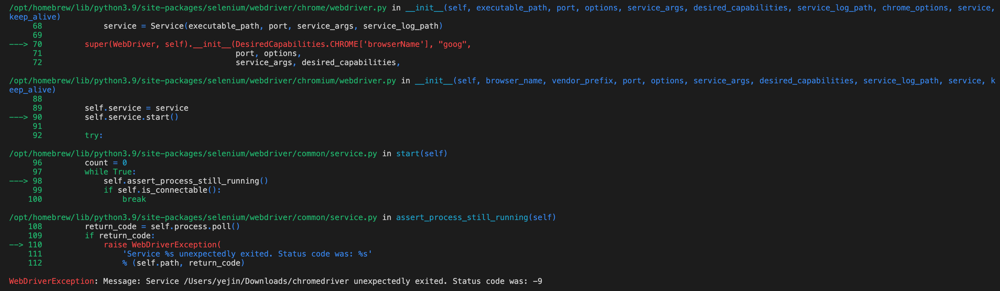
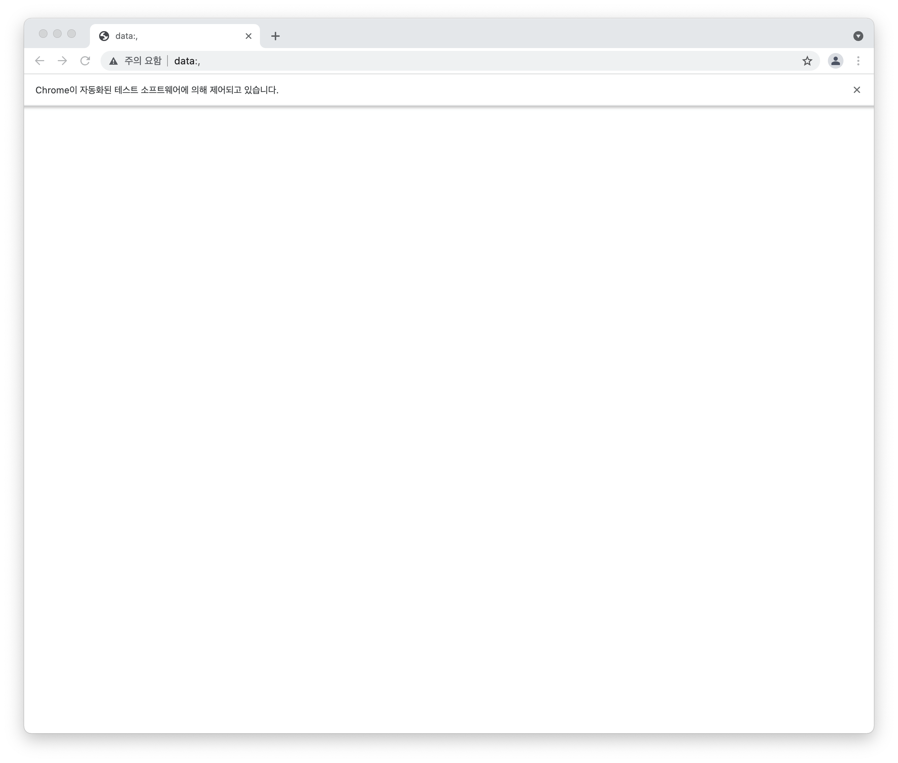

## What To-do
- [chrome 버전 확인](chrome://version/) 후
- 버전에 맞는 chromedriver를 [다운로드](https://sites.google.com/chromium.org/driver/)
- chromedriver 실행  

```
from selenium import webdriver

driver = webdriver.Chrome(executable_path = '~')
```

### 에러 발생
> WebDriverException: chromedriver unexpectedly exited. Status code was : -9 
> 

### 해결방법

```
$ cd (chromedriver 저장 위치)
$ xattr -d com.apple.quarantine chromedriver
```
- 이후 다시 돌려보면,   
  
창이 잘 뜬다!