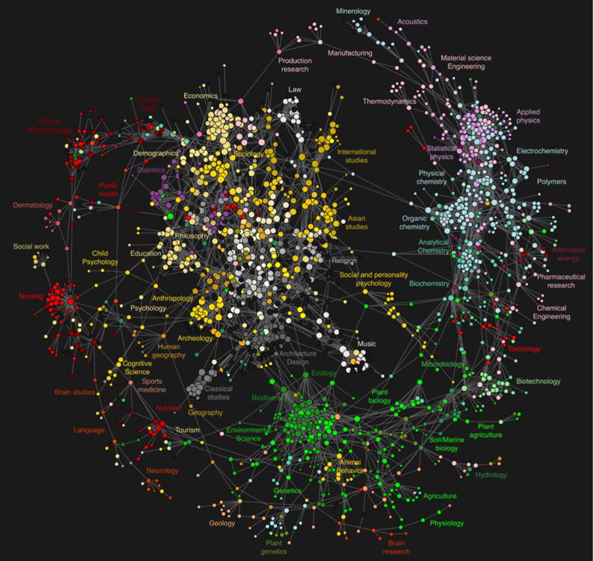
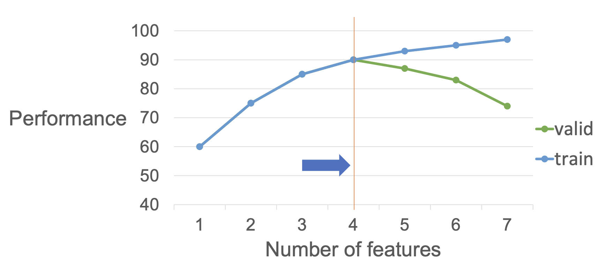
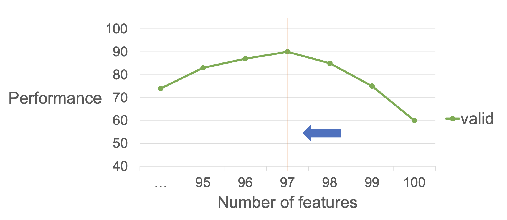
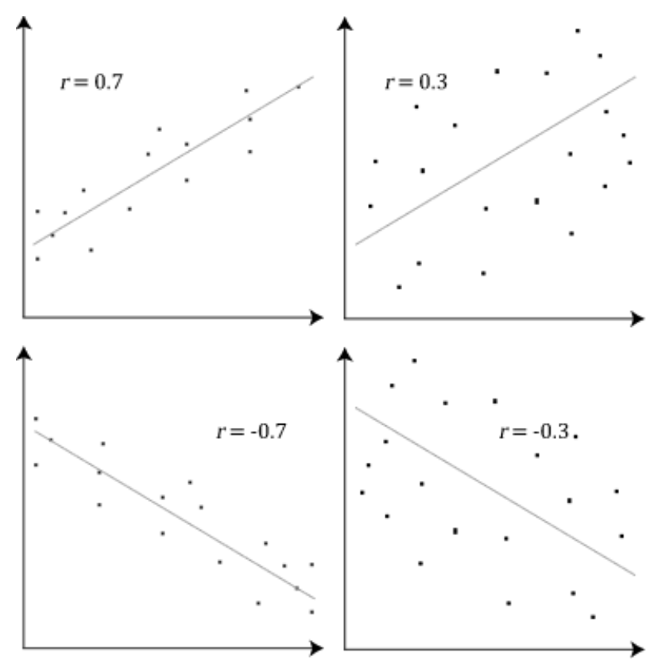

$$Feature = Attribute = Variable = Dimension$$
# Benefits of Dimension Reduction
- 적은 용량
- 빠른 계산
- **노이즈 제거**를 통한 data quality 향상
- **2D/3D 시각화 가능**

# 1. Feature Selection
- 차원 축소를 위해 여러 feature 중 task에 도움이 될 feature를 골라내는 작업
- 특정한 **목적**을 가지고, 전처리하는 과정으로 이루어짐

### Forward Selection

- 총 100개 feature 후보가 있다고 하면, 1개씩 feature로 학습
- 변수가 늘어날수록 학습 데이터의 성능은 점점 좋아짐 (loss는 점점 떨어짐)
- 하지만 valid data(unseen data)에 대해 성능이 어느 순간부터 떨어짐 = 이 때 가장 성능이 좋았던 4개 feature 조합을 찾아내는 것
- 어떤 것을 가장 먼저 추가할 것인가? 각각 1d으로 regression을 돌림. 총 100가지 서로 다른 feature를 사용했을 때 만들어지는 모델의 성능을 알 수 있음
- validation data의 성능을 가지고, 가장 좋은 성능을 가지는 feature를 먼저 선정.

### Backward Elimination

- foward와 반대방향
- 100개에서 하나씩 제외하며 validation 성능을 보는 것

### Correlation Coefficient

- 좀 더 명확한 패턴을 가지는 variable를 찾는 것이 target에 더 좋은 feature다!
- 상관성이 있느냐, 없느냐를 측정해서 feature 선정
- validation 성능을 보지 않고도 selection을 진행할 수 있는 방법